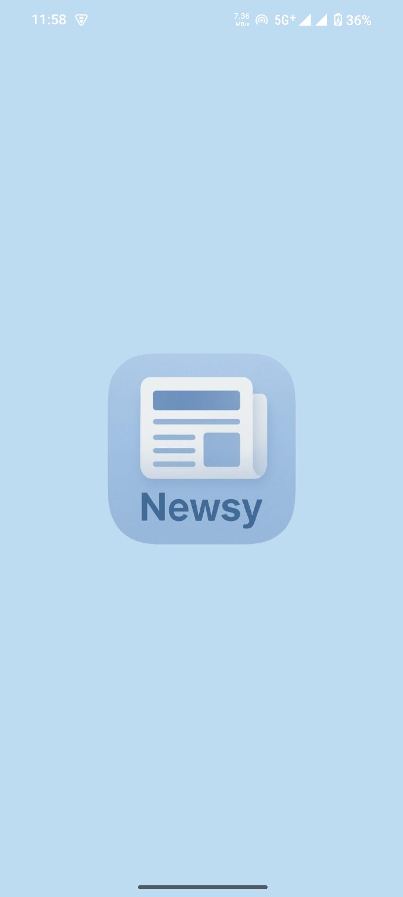
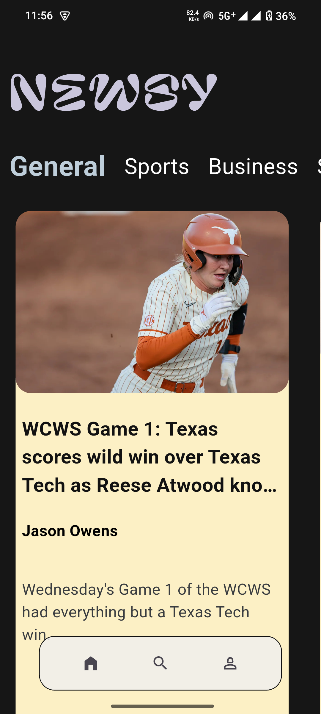
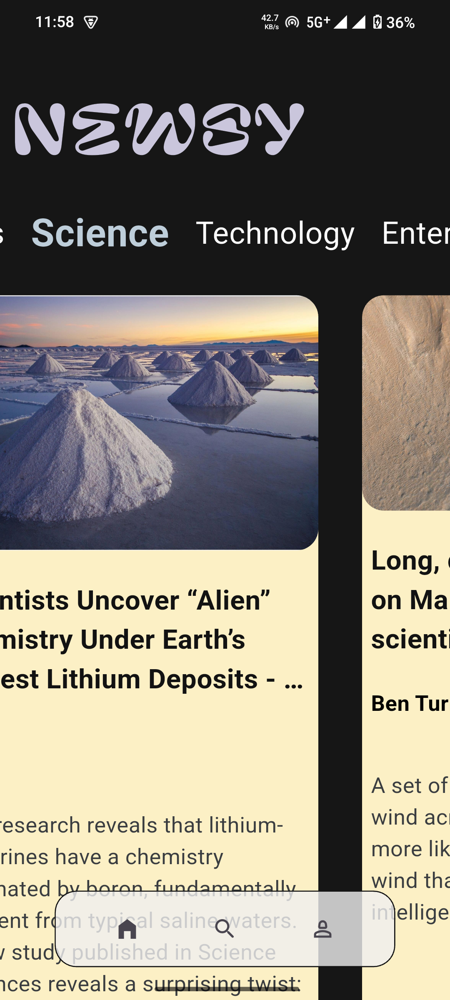
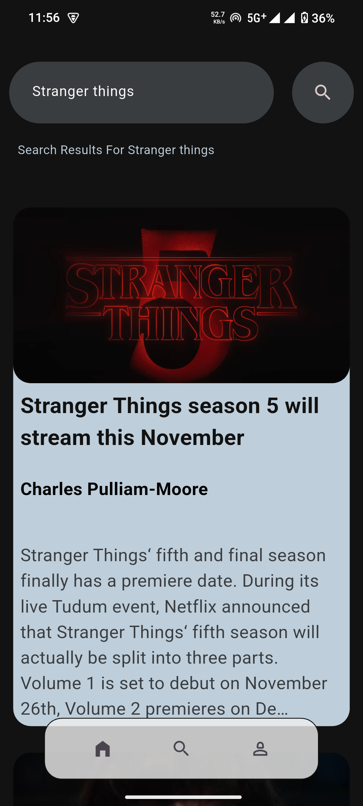

# 📰 Newsy - Your Daily Dose of News 🌟

**Newsy** is a sleek, beautifully designed Flutter news app bringing you the latest headlines from around the world!  
Browse your favorite categories, search trending news, and stay updated anytime, anywhere.

Built with ❤️ by **Mridul Sharma**..

---

## ✨ Features

- 🔥 **Trending News:** Stay updated with news from categories like Sports, Technology, Business, Science & more.  
- 🏄‍♂️ **Swipable Tiles:** Smooth horizontal scroll of news cards for quick browsing.  
- 🔎 **Powerful Search:** Instantly find articles by keywords with a friendly search UI.  
- 🖼️ **Cached Images:** Fast and offline-friendly images using `cached_network_image`.  
- 🧑‍💻 **About & Feedback:** Know the developer, explore the source code, report issues, and give feedback!  
- 🌈 **Dark Themed UI:** Easy on your eyes with an elegant dark background.  
---

## 📸 Screenshots

| Splash Screen | Home Screen | Swipable Tiles | 
|:-------------:|:-----------:|:--------------:|
|  |  |  |
| Search Page 1 | Search Page 2 | About Page |
|:-------------:|:-------------:|:----------:|
|  |  |  |

---

## 📥 Download Newsy APK

Want to try the app?  
👉 [Download Newsy APK here](https://drive.google.com/file/d/1qWSe3ab6YjEJDzfcF95nEwWlhwSWpMHx/view?usp=drive_link)

---

## 🚀 Getting Started (For Developers)

```bash
git clone https://github.com/MridulSharma2552007/Newsy.git
cd Newsy
flutter pub get
flutter run
```
## 🤝 Feedback & Contributions

Your feedback means a lot!

 ⭐ Star the repo on GitHub

  🍴 Fork & improve the project

   🐞 Report issues or request features here:
    GitHub Issues

Source code & contributions:
GitHub Repo
📱 Other Apps by Me:

Don’t miss my other amazing app WeatherZen — a beautiful Flutter weather app

## 📄 License

This project is licensed under the MIT License. See the LICENSE file for details.

Thank you for checking out Newsy!
Stay informed, stay curious. 🚀
..
